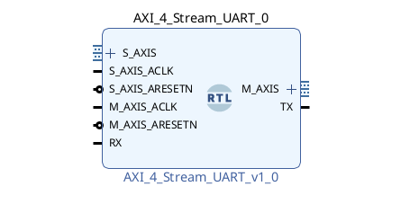
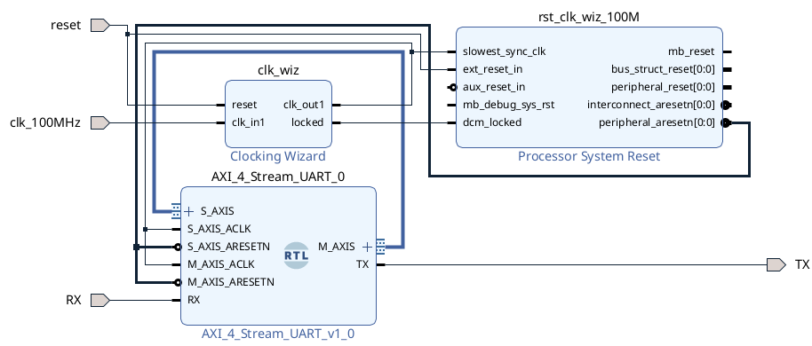

# AXI-4 Stream UART IP Core

## Key Features

-   Efficient conversion between AXI-4 Stream and serial interfaces.
-   Full-duplex or simplex operation with fully decoupled transmitter and receiver interfaces.
-   Configurable data bits per character for both the receiver and transmitter.
-   Adjustable baud rates for both the receiver and transmitter.
-   Configurable clock frequencies up to 150 MHz.
-   Compact design: 339 LUTs and 485 FFs.
-   All components are custom modeled in VHDL.
-   Zero control complexity —plug-and-play approach.

## Design Limitations

-   No parity check implemented.
-   Tested only on Zynq7000 SoC with Artix-7 FPGA (speedgrade -1).
-   No software drivers implemented.
-   No benchmarks or performance measurements conducted.

## Usage

This repository contains all components necessary for synthesizing and using this IP core, along with a testbench script and an example of an implemented block design. To use the IP core:

1. Download the repository content to your computer.

2. Integrate the IP core directly into your design (or block design), or add it to your local IP core repository for use in your projects.

3. To run the provided block design example, execute the TCL script located in `./tb` within Vivado.
 
**Table 1**  - The generic parameters used to configure the IP core.

| Generic Name        | Description                         | Default Value  |
|---------------------|-------------------------------------|----------------|
| `C_RX_BAUDRATE`     | Receiver baud rate value            | 115_200        |
| `C_RX_CLOCK_FREQ`   | Receiver clock frequency            | 100_000_000    |
| `C_RX_DATA_BITS`    | Receiver number of data bits        | 8              |
| `C_RX_FIFO_DEPTH`   | Receiver FIFO buffer depth          | 16             |
| `C_TX_BAUDRATE`     | Transmitter baud rate value         | 115_200        |
| `C_TX_CLOCK_FREQ`   | Transmitter clock frequency         | 100_000_000    |
| `C_TX_DATA_BITS`    | Transmitter number of data bits     | 8              |
| `C_TX_FIFO_DEPTH`   | Transmitter FIFO buffer depth       | 16             |

The IP core is depicted in **Figure 1** while the example loopback design is depicted in **Figure 2**.

For more information, refer to the documentation provided in `./doc` or contact me at `ronaldo.tsela23@gmail.com`.
